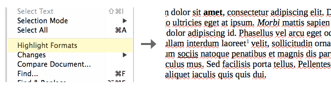
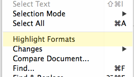

Highlight formats
=================

Highlights LO.org or OO.org document formats so that it's easier to spot them. Usefull when working with desktop publishing apps like Indesign or Scribus.

Installation
------------

Follow these steps to install the script as a menu item in LO.org:

1. ...
2. ...
3. ...

Known Issues
------------

- Seems that sub/supscript highlight doesn't work on LO.org anymore.
- All highlight actions should be grouped to undo in one step.
